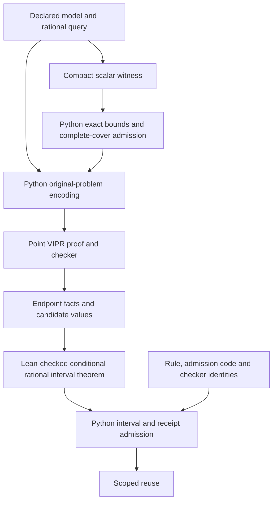

# Checked claims and their dependencies

Experiments 96–100 use fixed-feasibility 0–1 knapsack with signed integer affine coefficients. The runtime contracts cover the declared small input domain; they are not generic JSON or hostile-process verification claims.

| Claim | Evidence | Scope and remaining trust |
|---|---|---|
| A packing reaches the optimum at one rational parameter | Original-problem VIPR certificate, `viprchk`, independent enumeration | The Python model-to-file adapter must encode the intended original problem. VIPR is not claimed formally verified. No presolve transformation is used. |
| A compact witness covers all feasible packings and bounds them | Python structural cover/bound checks; independent exhaustive cover audit; expansion into the same externally accepted VIPR proof | Four integers per cell omit quantities that can be reconstructed. This is a serialization and admission route, not a new proof system. |
| Exact scaled point values map to affine rational values | Lean `scaled_affine`; runtime denominator/value checks | The algebraic identity is formalized. The JSON parser, extraction of subset sums and compiler are not. |
| Two endpoint bounds imply interpolated regret, with zero gaps implying optimality | Lean `affine_interval_regret` and `affine_interval_optimal`; independently written `ExpectedIntervalRegret` type ascription | One fixed feasible predicate and unchanged affine functions, rational interval/query. No formal real-number completion or nonlinear transfer. |
| A previously admitted point receipt remains applicable | Exact model/time matching, proof and witness bytes, checksum seal, declared dependency identities, primal checks | Trusted admission and fixed execution environment. Checksums are consistency checks, not authentication. Python runtime not formally verified. |
| An interrupted reference build retains valid bounds and can resume | Pending/finished branch transcript replay, independent subset-cover and enclosure audit, fresh completion comparison | A small exhaustive reference tree, not native production-solver checkpoint resumption. |
| Reuse is faster on a specified observation sequence | Three complete CPU repetitions, checker child CPU charged, fresh replication | Finite measurements on ten mathematical models; timing rankings near equality vary. No universal speed or competitive guarantee. |

The arrows into the mathematical bridge still require the intended model and candidate to match the checked point facts. A proof assistant accepting the conditional theorem does not verify those Python arrows.

Each new receipt/checkpoint records the hashes of `formal/Endpoint.lean`, `code/witness.py` and the frozen VIPR binary, as well as its model and time. Experiments 96/99 change those declared identities and observe rejection. The whole frozen source/dependency set is separately hashed in `Freeze.json`. This is a declared compatibility contract, not proof that an arbitrary running process reflects current source bytes.

The formal release is pinned to Lean 4.24.0 and its official archive SHA-256 in `Lean-setup.json`; it uses `Std`, with no Mathlib dependency. Permitted theorem axioms are `propext`, `Classical.choice` and `Quot.sound`. A false statement ascription was rejected. Comparator was not executed, and its sandbox/declaration-comparison guarantees are not claimed.

The CP 2024 certifying-DP and VeriPB implementations have not been reproduced in this batch. The established route actually used is VIPR, inherited from experiments 51–95. The current adapter emits point proofs; interval reasoning is a separate conditional theorem. General proof-format expressiveness is not ruled out by that adapter limitation.
